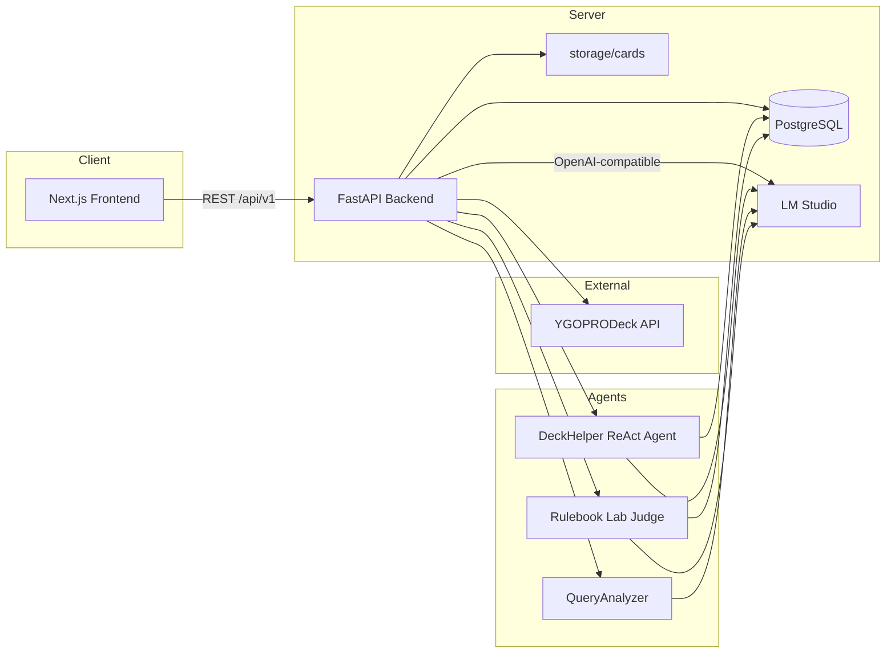
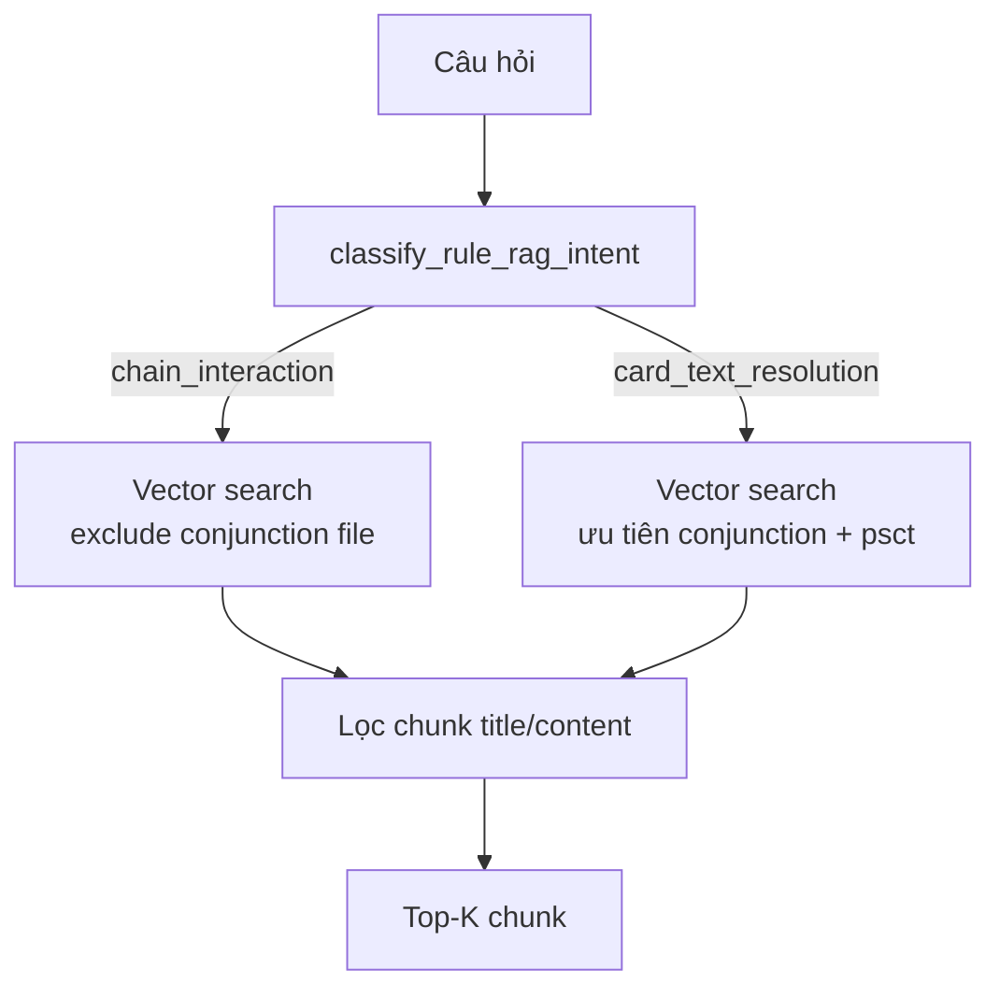
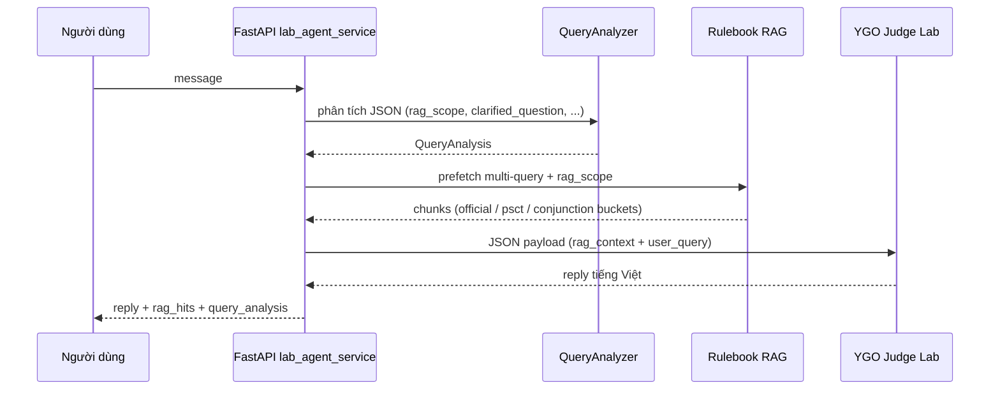

# YGO Deck Helper — Tài liệu dự án

Ứng dụng web hỗ trợ người chơi Yu-Gi-Oh!: đồng bộ thư viện lá bài từ [YGOPRODeck API v7](https://ygoprodeck.com/api-guide/), duyệt và lọc lá bài, import decklist `.ydk`, trò chuyện với AI agent **DeckHelper**, và **giải thích luật / PSCT** qua **Rulebook RAG** + agent **Rulebook Lab** (AgentScope + LM Studio + pgvector).

Monorepo gồm ba phần chính:

| Thư mục | Vai trò |
|---------|---------|
| `frontend/` | Next.js (App Router), TypeScript, Tailwind CSS |
| `backend/` | FastAPI, SQLAlchemy async, PostgreSQL |
| `agents/` | AgentScope ReAct agent, tools, cấu hình LM Studio |

Tài liệu gốc về cấu trúc thư mục: [`architecture.md`](../architecture.md). Hướng dẫn chạy local: [`README.md`](../README.md) ở thư mục gốc.

---

## 1. Trạng thái tính năng hiện tại

### Đã có

- **PostgreSQL** — lưu toàn bộ catalog lá bài đồng bộ từ YGOPRODeck.
- **Đồng bộ lá bài** — job nền, theo dõi tiến độ, bỏ qua khi phiên bản API không đổi (`force` để ép sync).
- **Lưu ảnh local** — `backend/storage/cards/{passcode}/`, phục vụ qua `/static/cards/...`.
- **Thư viện lá bài** (`/cards`) — grid ảnh, infinite scroll, tìm kiếm, bộ lọc YGO (Monster / Spell / Trap / Link, ATK/DEF, banlist TCG, …).
- **Import YDK** (`/import-ydk`) — kéo thả file `.ydk`, hiển thị Main (60) / Extra (15) với ảnh lá bài.
- **Settings** (`/settings`) — cấu hình LM Studio, kiểm tra kết nối, thử chat agent.
- **DeckHelper agent** — ReAct (tối đa 10 vòng), tools `query_card_database` và `web_search`; có **QueryAnalyzer** chuẩn hóa câu hỏi trước khi trả lời.
- **Rulebook RAG** (`/rulebook-rag`) — upload markdown, cắt chunk theo `##`, embed LM Studio, lưu **pgvector**; semantic search có lọc theo intent.
- **Rulebook Lab** (`/lab`) — agent **YGO Judge Lab** (Gemma hoặc model trong `LAB_CHAT_MODEL`): QueryAnalyzer → RAG lọc nguồn → trả lời luật bằng tiếng Việt.
- **QueryAnalyzer** — agent không tool, phân tích câu hỏi + `rag_scope` trước RAG/agent chính (có thể tắt qua `QUERY_ANALYZER_ENABLED`).

### Chưa có (theo roadmap)

- Deck builder lưu deck vào DB.
- Auth (đăng nhập / đăng ký).
- Agent monitor streaming (SSE).
- Trang xây dựng deck đầy đủ tích hợp agent.

---

## 2. Luồng hoạt động (Workflow)

### 2.1. Tổng quan hệ thống



> RAG embedding và chat đều qua LM Studio (OpenAI-compatible API). Vector search chạy trong PostgreSQL (pgvector).

### 2.2. Đồng bộ lá bài (Dashboard)

Luồng chính khi người dùng bấm **Đồng bộ lá bài** trên `/dashboard`:

1. Frontend gọi `POST /api/v1/cards/sync` (body: `{ "force": false | true }`).
2. Backend tạo bản ghi `ygo_card_sync_jobs` (`status = pending`), rồi chạy task nền (`asyncio.create_task`).
3. Chỉ cho phép **một job** đang `processing` (lock + kiểm tra DB).
4. Lấy `database_version` từ YGOPRODeck; nếu không `force` và version trùng job `completed` gần nhất → `status = skipped`.
5. Phân trang `fetch_cards_page` (kích thước trang: `CARD_SYNC_PAGE_SIZE` trong settings).
6. Với mỗi lá bài:
   - **Upsert** `ygo_cards` và thay thế quan hệ con (`ygo_card_sets`, `ygo_card_images`, `ygo_card_prices`).
   - **Tải ảnh** (full / small / cropped) vào `storage/cards/{passcode}/`, cập nhật `local_path*` trong DB.
7. Cập nhật tiến độ job mỗi 25 lá (`total_fetched`, `inserted`, `updated`, `images_downloaded`, `errors_count`).
8. Kết thúc: `status = completed` hoặc `failed` (kèm `error_message`).

Frontend poll `GET /api/v1/cards/sync/{job_id}` hoặc `GET /api/v1/cards/sync/latest` để hiển thị thanh tiến độ.

**Trạng thái job** (`SyncJobStatus`):

| Giá trị | Ý nghĩa |
|---------|---------|
| `pending` | Vừa tạo, chưa xử lý |
| `processing` | Đang đồng bộ |
| `completed` | Hoàn tất |
| `failed` | Lỗi nghiêm trọng |
| `skipped` | Bỏ qua (DB version API không đổi) |

### 2.3. Thư viện lá bài (`/cards`)

1. Trang load `GET /api/v1/cards/filter-options` để điền dropdown bộ lọc.
2. Danh sách: `GET /api/v1/cards` với query `CardSearchParams` (tìm theo tên/passcode, nhóm lá, frame type, attribute, race, khoảng ATK/DEF/level/link, archetype, banlist TCG, sort/order, `offset`/`limit`).
3. Backend áp dụng quy tắc lọc YGO trong `app/domain/card_filter_rules.py` (ví dụ Spell/Trap race tách khỏi monster race).
4. Chi tiết một lá: `GET /api/v1/cards/{passcode}`; ảnh hiển thị từ URL static nếu đã sync.
5. UI: infinite scroll, panel chi tiết bên phải, preview khi hover.

### 2.4. Import YDK (`/import-ydk`)

Luồng **chủ yếu phía client** (chưa lưu deck vào PostgreSQL):

1. Người dùng kéo thả file `.ydk`.
2. `parseYdk` (frontend) đọc passcode Main / Extra.
3. Gọi API lấy metadata/ảnh lá bài (theo passcode) để render grid Main (60 ô) / Extra (15 ô).

### 2.5. Agent DeckHelper (Settings / API)

1. Cấu hình LM Studio lưu qua `GET/PUT /api/v1/settings/lm-studio`; kiểm tra `GET .../status`.
2. Chat: `POST /api/v1/agent/chat` với `{ "message": "..." }`.
3. `agent_service` chạy **QueryAnalyzer** (domain `deck`) → format input chuẩn hóa → `create_deck_helper_agent()`.
4. Trong vòng ReAct (≤ `max_iters = 10`), agent có thể gọi:
   - **`query_card_database`** — SQL async qua `asyncpg` vào `ygo_cards` (+ sets/images).
   - **`web_search`** — stub/tìm kiếm web (bổ sung khi chưa có trong DB).

CLI tương đương (thư mục `agents/`):

```bash
cd agents && python main_agent.py "Câu hỏi về deck..."
```

### 2.6. Rulebook RAG (ingest & search)

**Mục tiêu:** chỉ đưa vào context những đoạn luật **đúng loại câu hỏi**, tránh retrieve nhầm (ví dụ bài Conjunctions khi hỏi “bị phá hủy trên Chain”).

#### Ingest

1. Frontend `/rulebook-rag` hoặc `POST /api/v1/rag/rulebook/ingest` (multipart file `.md`).
2. `rulebook_chunker.extract_rulebook_chunks()` — mỗi tiêu đề `##` (không phải `###`) = một chunk.
3. `create_embeddings()` qua LM Studio (`RAG_EMBEDDING_MODEL`, mặc định `text-embedding-embeddinggamma-300m-qat`).
4. Lưu bảng `rulebook_chunk_embeddings` — **mỗi `source_filename` ingest riêng** (upload file mới không xóa chunk file khác).

**File nguồn khuyến nghị:**

| File | Dùng cho |
|------|----------|
| `ygo_core_rulebook_summary.md` | Spell Speed, Chain, luật cốt lõi |
| `ygo_advanced_psct.md` | PSCT, activation, timing |
| `ygo_advanced_conjunctions.md` | And / Then / Also — **chỉ** câu hỏi nội tại 1 lá |

#### Search & lọc intent

`POST /api/v1/rag/rulebook/search` body:

```json
{
  "query": "destroy activated effect chain",
  "limit": 4,
  "rag_scope": "chain_interaction"
}
```

`rag_scope` (tự suy từ câu hỏi nếu bỏ trống):

| Giá trị | Ý nghĩa | Lọc retrieve |
|---------|---------|----------------|
| `chain_interaction` | Tranh chấp Chain, destroy vs negate, Spell Speed | Core + PSCT; **cấm** Conjunctions (SQL + lọc chunk) |
| `card_text_resolution` | Then/Also/`:``;` trên text một lá | Conjunctions + PSCT |
| `general_rulebook` | Khác | Rulebook chung, vẫn loại Conjunctions khi không phù hợp |

Logic: `agents/domain/rule_rag_intent.py` (regex VI/EN) + `filter_hits_by_intent()` sau vector search.



### 2.7. Rulebook Lab — trả lời câu hỏi luật (`/lab`)

Luồng đầy đủ khi `POST /api/v1/lab/chat`:



**Bước chi tiết:**

1. **QueryAnalyzer** (`workflows/query_analyzer_agent.py`) — không tool; output JSON gồm `rag_scope`, `clarified_question`, `rag_search_queries` (ưu tiên từ khóa PSCT tiếng Anh).
2. **Prefetch RAG** — nhiều truy vấn embedding, merge theo `chunk_id`; truy vấn bổ sung theo intent (vd. *"destroy does not negate activated effect"* cho chain).
3. **Structured context** (`domain/rag_context_builder.py`) — gói tin gửi Judge Lab:

```json
{
  "rag_context": {
    "official_rulebook_rule": "...",
    "psct_rule": "...",
    "conjunction_rule": ""
  },
  "user_query": "Câu hỏi đã chuẩn hóa",
  "query_analysis": { "intent": "rule_question", "rag_scope": "chain_interaction" }
}
```

Với `chain_interaction`, `conjunction_rule` **để trống**.

4. **YGO Judge Lab** (`workflows/rulebook_lab_agent.py`) — system prompt Head Judge (tiếng Anh): quy tắc *Destroy ≠ Negate*, Continuous/Field phải còn trên sân, không dùng Conjunction để giải thích Chain. Trả lời **tiếng Việt** cho người chơi.
5. Tools khi thiếu context: `search_official_rulebook` (cũng lọc intent), `query_card_database`.

**Request Lab** (`LabChatRequest`):

| Field | Mặc định | Mô tả |
|-------|----------|--------|
| `use_rag` | `true` | Prefetch chunk trước agent |
| `use_query_analyzer` | `true` | Chạy QueryAnalyzer |
| `rag_limit` | `3` | Số chunk tối đa |

**Response** gồm `reply`, `rag_hits`, `query_analysis`, `rag_scope` (hiển thị trên UI Lab).

### 2.8. Health check

`GET /health` → `{ "status": "ok" | "degraded", "database": "connected" | "disconnected" }`.

---

## 3. Cấu trúc database (PostgreSQL)

Database mặc định: **`ygo-helper`**. Migration: Alembic trong `backend/alembic/versions/`.

### 3.1. Sơ đồ quan hệ (ER)

```mermaid
erDiagram
  ygo_cards ||--o{ ygo_card_sets : "has"
  ygo_cards ||--o{ ygo_card_images : "has"
  ygo_cards ||--o| ygo_card_prices : "has"
  ygo_card_sync_jobs {
    int id PK
    string status
    bool force
    string api_db_version_before
    string api_db_version_after
    int total_expected
    int total_fetched
    int inserted
    int updated
    int images_downloaded
    int errors_count
    text error_message
    timestamptz started_at
    timestamptz finished_at
  }

  ygo_cards {
    bigint passcode PK
    string name
    string type
    string frame_type
    text desc
    int atk
    int def
    int level
    string race
    string attribute
    int scale
    int linkval
    jsonb linkmarkers
    string archetype
    string ygoprodeck_url
    jsonb banlist_info
    jsonb misc
    string api_db_version
    timestamptz synced_at
  }

  ygo_card_sets {
    int id PK
    bigint card_passcode FK
    string set_name
    string set_code
    string set_rarity
    string set_rarity_code
    numeric set_price
  }

  ygo_card_images {
    int id PK
    bigint card_passcode FK
    bigint image_passcode
    string image_url
    string image_url_small
    string image_url_cropped
    string local_path
    string local_path_small
    string local_path_cropped
    bool is_default
  }

  ygo_card_prices {
    bigint card_passcode PK_FK
    numeric cardmarket_price
    numeric tcgplayer_price
    numeric ebay_price
    numeric amazon_price
    numeric coolstuffinc_price
  }
```

### 3.2. Bảng `ygo_cards`

Bảng trung tâm; **khóa chính** là `passcode` (ID lá bài YGO).

| Cột | Kiểu | Mô tả |
|-----|------|--------|
| `passcode` | `BIGINT` PK | Mã lá bài (8 chữ số) |
| `name` | `VARCHAR(255)` | Tên lá bài (index) |
| `type` | `VARCHAR(64)` | Loại (ví dụ "Effect Monster") |
| `frame_type` | `VARCHAR(32)` | Khung (normal, effect, link, …) — index |
| `desc` | `TEXT` | Văn bản hiệu ứng |
| `atk`, `def` | `INTEGER` | Chỉ số quái — index |
| `level` | `INTEGER` | Cấp / hạng — index |
| `race` | `VARCHAR(64)` | Hệ (Dragon, Spell Card, …) — index |
| `attribute` | `VARCHAR(16)` | Thuộc tính quái — index |
| `scale` | `INTEGER` | Pendulum — index |
| `linkval` | `INTEGER` | Link rating — index |
| `linkmarkers` | `JSONB` | Mũi link |
| `archetype` | `VARCHAR(128)` | Archetype — index |
| `ygoprodeck_url` | `VARCHAR(512)` | URL trang YGOPRODeck |
| `banlist_info` | `JSONB` | Trạng thái cấm (TCG/OCG/GOAT, …) |
| `misc` | `JSONB` | Dữ liệu phụ từ API |
| `api_db_version` | `VARCHAR(64)` | Version DB lúc sync |
| `synced_at` | `TIMESTAMPTZ` | Thời điểm đồng bộ gần nhất |

**Quan hệ:** `1:N` → `ygo_card_sets`, `ygo_card_images`; `1:1` → `ygo_card_prices`. Xóa lá bài → cascade xóa bản ghi con.

### 3.3. Bảng `ygo_card_sets`

Bộ bài / rarity từng lá (một lá có thể xuất hiện nhiều set).

| Cột | Kiểu | Mô tả |
|-----|------|--------|
| `id` | `SERIAL` PK | |
| `card_passcode` | `BIGINT` FK → `ygo_cards` | |
| `set_name`, `set_code` | | Tên và mã set |
| `set_rarity`, `set_rarity_code` | | Độ hiếm |
| `set_price` | `NUMERIC(12,4)` | Giá tham khảo set |

Mỗi lần upsert lá bài, backend **xóa hết** set cũ của passcode đó rồi insert lại từ API.

### 3.4. Bảng `ygo_card_images`

Ảnh lá bài (có thể nhiều art / passcode ảnh khác nhau).

| Cột | Kiểu | Mô tả |
|-----|------|--------|
| `id` | `SERIAL` PK | |
| `card_passcode` | `BIGINT` FK | |
| `image_passcode` | `BIGINT` | ID ảnh trên YGOPRODeck |
| `image_url*` | | URL gốc (full, small, cropped) |
| `local_path*` | | Đường dẫn tương đối trong `storage/cards/` |
| `is_default` | `BOOLEAN` | Ảnh mặc định hiển thị |

### 3.5. Bảng `ygo_card_prices`

Giá tham khảo thị trường (một dòng / lá).

| Cột | Mô tả |
|-----|--------|
| `card_passcode` | PK + FK |
| `cardmarket_price`, `tcgplayer_price`, `ebay_price`, `amazon_price`, `coolstuffinc_price` | `NUMERIC(12,4)` |

### 3.6. Bảng `ygo_card_sync_jobs`

Theo dõi job đồng bộ (không FK tới lá bài).

| Cột | Mô tả |
|-----|--------|
| `id` | PK |
| `status` | `pending` / `processing` / `completed` / `failed` / `skipped` |
| `force` | Ép sync dù version API không đổi |
| `api_db_version_before` / `after` | Version YGOPRODeck trước/sau |
| `total_expected` | Tổng lá dự kiến (từ meta API) |
| `total_fetched`, `inserted`, `updated` | Thống kê tiến độ |
| `images_downloaded`, `errors_count` | Ảnh tải / lỗi từng lá |
| `error_message` | Chi tiết khi failed/skipped |
| `started_at`, `finished_at` | Thời gian |

### 3.7. Index bổ sung (migration `002`)

Trên `ygo_cards` để tăng tốc bộ lọc: `frame_type`, `attribute`, `level`, `atk`, `def`, `linkval`, `scale`, `race` (ngoài index sẵn có trên `name`, `archetype`).

### 3.8. Bảng `rulebook_chunk_embeddings` (migration `003`)

Lưu chunk Rulebook đã embed cho RAG. Cần extension PostgreSQL **`vector`** (Alembic tạo `CREATE EXTENSION IF NOT EXISTS vector`).

| Cột | Kiểu | Mô tả |
|-----|------|--------|
| `id` | `SERIAL` PK | |
| `chunk_id` | `VARCHAR(64)` UNIQUE | Slug từ tiêu đề section |
| `title` | `VARCHAR(255)` | Tiêu đề `##` |
| `description` | `TEXT` | Preview ngắn |
| `content` | `TEXT` | Nội dung chunk (markdown) |
| `source_headings` | `TEXT` | JSON danh sách heading |
| `embedding_model` | `VARCHAR(128)` | Model LM Studio đã dùng |
| `source_filename` | `VARCHAR(255)` | Tên file upload — **dùng lọc intent RAG** |
| `content_hash` | `VARCHAR(64)` | SHA-256 nội dung |
| `embedding` | `vector(768)` | Vector pgvector (HNSW index) |

Index: `chunk_id`, `content_hash`, HNSW trên `embedding` (cosine distance `<=>`).

### 3.9. Lưu ý vận hành DB

```bash
cd backend && alembic upgrade head
```

Biến môi trường: xem `backend/.env.example` (`POSTGRES_*`, `RAG_EMBEDDING_*`, `LAB_CHAT_MODEL`, `QUERY_ANALYZER_ENABLED`). Agent tools dùng cùng biến `POSTGRES_*` khi chạy CLI trong `agents/`.

---

## 4. API REST (tóm tắt)

| Method | Path | Mô tả |
|--------|------|--------|
| GET | `/health` | Health + PostgreSQL |
| GET | `/api/v1/cards` | Danh sách / tìm kiếm / lọc |
| GET | `/api/v1/cards/filter-options` | Metadata cho UI filter |
| GET | `/api/v1/cards/{passcode}` | Chi tiết lá bài |
| GET | `/api/v1/cards/stats` | Thống kê thư viện + sync |
| POST | `/api/v1/cards/sync` | Bắt đầu job đồng bộ |
| GET | `/api/v1/cards/sync/{job_id}` | Trạng thái job |
| GET | `/api/v1/cards/sync/latest` | Job gần nhất |
| GET/PUT | `/api/v1/settings/lm-studio` | Cấu hình LM Studio |
| GET | `/api/v1/settings/lm-studio/status` | Ping LM Studio |
| POST | `/api/v1/agent/chat` | Chat DeckHelper |
| POST | `/api/v1/rag/rulebook/preview` | Preview chunk markdown |
| POST | `/api/v1/rag/rulebook/ingest` | Ingest + embed Rulebook |
| GET | `/api/v1/rag/rulebook/stats` | Thống kê RAG |
| POST | `/api/v1/rag/rulebook/search` | Semantic search (body: `rag_scope` tùy chọn) |
| GET | `/api/v1/lab/info` | Trạng thái Lab (LM Studio + RAG) |
| POST | `/api/v1/lab/chat` | Chat Rulebook Lab (RAG + Judge agent) |

Static: `GET /static/cards/{passcode}/{image_id}_small.jpg` (và các biến thể khác).

---

## 5. Cấu trúc frontend (route chính)

| Route | Mô tả |
|-------|--------|
| `/` | Redirect → `/dashboard` |
| `/dashboard` | Panel đồng bộ YGOPRODeck |
| `/cards` | Thư viện lá bài |
| `/import-ydk` | Import file `.ydk` |
| `/settings` | LM Studio + thử agent DeckHelper |
| `/rulebook-rag` | Upload / preview / ingest Rulebook, thống kê chunk |
| `/lab` | Rulebook Lab — hỏi luật (RAG + QueryAnalyzer + Judge agent) |

Layout nhóm `(app)` dùng `AppNav` chung.

---

## 6. Cấu trúc backend (lớp logic)

```text
backend/app/
├── api/v1/          # cards, settings, agent, rag, lab, auth (stub)
├── core/            # config, database session
├── models/          # card.py, rag.py (rulebook_chunk_embeddings)
├── schemas/         # Pydantic v2 (rag, lab, query_analysis, …)
├── repositories/    # CardRepository, RulebookRagRepository (pgvector)
├── services/        # sync, rulebook_rag, lab_agent, query_analyzer, agent
└── domain/          # card_filter_rules, rulebook_chunker
```

Logic phân loại RAG intent nằm trong `agents/domain/` (import qua `sys.path` từ backend services).

---

## 7. Hệ thống Agent (`agents/`)

```text
agents/
├── config/lm_studio.json
├── domain/
│   ├── query_analysis.py       # Parse JSON QueryAnalyzer, format input
│   ├── rule_rag_intent.py      # chain vs card_text vs general — lọc RAG
│   └── rag_context_builder.py  # Gói official/psct/conjunction cho Judge Lab
├── workflows/
│   ├── react_deck_agent.py         # DeckHelper
│   ├── rulebook_lab_agent.py       # YGO Judge Lab (system prompt Head Judge)
│   ├── query_analyzer_agent.py     # Phân tích câu hỏi trước RAG/agent
│   └── agent_runner.py             # Chạy agent tới khi có reply (auto-confirm tool)
├── tools/
│   ├── db_queries.py
│   ├── web_search.py
│   └── rulebook_rag.py             # Tool RAG (có lọc intent)
└── main_agent.py
```

| Agent | Vai trò | Tools |
|-------|---------|--------|
| **QueryAnalyzer** | Chuẩn hóa câu hỏi, `rag_scope`, truy vấn RAG | Không |
| **DeckHelper** | Deck, tra cứu lá bài | DB, web |
| **Rulebook Lab** | Trả lời luật chính xác từ RAG context | RAG, DB |

Backend thêm `agents/` vào `sys.path` — không cần process agent riêng khi gọi API `/agent/chat` hoặc `/lab/chat`.

### 7.1. Quy tắc reasoning (Judge Lab)

Tóm tắt system prompt — chi tiết trong `rulebook_lab_agent.py`:

1. Phân biệt **Chain giữa 2 lá** vs **thứ tự effect trên 1 lá**.
2. **Destroy ≠ Negate** — effect đã activate vẫn resolve (trừ Continuous/Field/Pendulum phải còn trên sân).
3. **Không** dùng quy tắc Conjunction (And/Then/Also) để giải thích bị destroy trên Chain.
4. **Suy luận grounded trong `rag_context`**: phán quyết mở đầu bằng `**ĐƯỢC PHÉP (YES)**:` / `**KHÔNG ĐƯỢC PHÉP (NO)**:` / `**TÙY LOẠI BÀI (DEPENDS)**:` — không dùng "Có./Không." đơn lẻ (tránh mâu thuẫn đầu–đuôi); giải thích tự nhiên sau label.

### 7.2. Biến môi trường liên quan RAG / Lab

| Biến | Mặc định | Mô tả |
|------|----------|--------|
| `RAG_EMBEDDING_MODEL` | `text-embedding-embeddinggamma-300m-qat` | Model embedding LM Studio |
| `RAG_EMBEDDING_DIMENSION` | `768` | Chiều vector (khớp migration) |
| `LAB_CHAT_MODEL` | `google/gemma-4-e4b` | Model chat cho `/lab` |
| `QUERY_ANALYZER_ENABLED` | `true` | Bật/tắt QueryAnalyzer toàn cục |

---

## 8. Tài liệu liên quan

- [`../README.md`](../README.md) — cài đặt và chạy local
- [`../architecture.md`](../architecture.md) — quy ước cấu trúc monorepo
- [`../todo.md`](../todo.md) — tiến độ và bước tiếp theo
